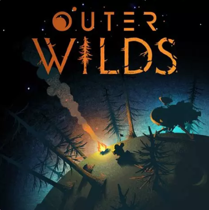

# YOLOv11: Detecting the Quantum Moon in Outer Wilds

<p align="center">
  
</p>

A computer vision pipeline based on **YOLOv11** is used to detect the *Quantum Moon* in gameplay footage from *Outer Wilds*. This repository provides a reproducible workflow for **training**, **inference**, and **evaluation** of a custom object detector using the [Ultralytics YOLOv11](https://github.com/ultralytics/ultralytics) implementation.

## Objective

This project enables detection of the *Quantum Moon* through:

- Training a YOLOv11 model on annotated gameplay images  
- Running inference on images or video footage  
- Evaluating the model's performance (mAP, precision, recall)  

It is built with flexibility and reproducibility in mind, using a CLI interface to switch between modes.

## Model Used

We fine-tune the [`yolo11s.pt`](https://github.com/ultralytics/ultralytics) model checkpoint (a small variant of YOLOv11) and save the best performing weights as:

```bash
models/yolo11-quantummoon.pt
```

## Prerequisites

- Python 3.8+
- Ultralytics library
- A GPU with CUDA (recommended)

## Setup & Usage Guide

1. Clone and Setup

```bash
git clone https://github.com/VitoTito/quantum_moon.git
cd quantum_moon
python3 -m venv yolo_env
source yolo_env/bin/activate # Or yolo_env/Scripts/activate
pip install -r requirements.txt
```

2. Train the model (if needed, weights are already given)

```bash
python main.py train
```

You can customize it : 

```bash
python main.py train --model yolo11s.pt --data data/dataset.yaml --epochs 50 --imgsz 640 --batch 16 --device 0 --name yolo11-quantummoon
```

3. Evaluate the model

```bash
python main.py eval --weights models/yolo11-quantummoon.pt
```


4. Run inference : 

- On images : 

```bash
python main.py infer --source infer/test_image.png --weights models/yolo11-quantummoon.pt
```

- Or on a video : 

```bash
python main.py infer --source infer/test_video.mp4 --weights models/yolo11-quantummoon.pt
```

